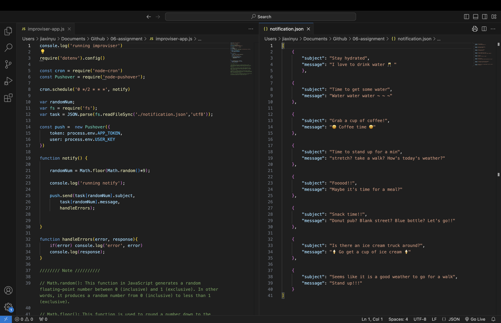
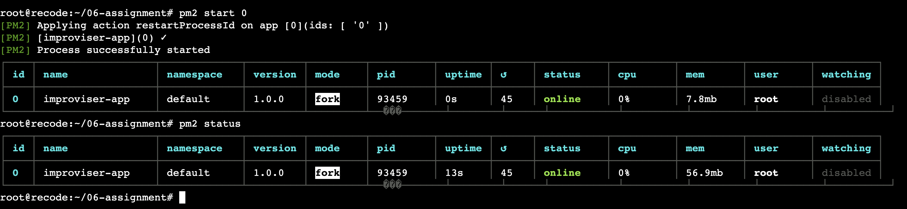
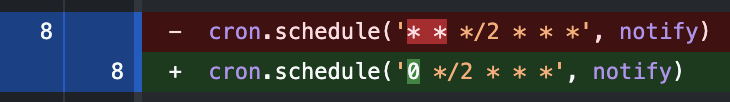

# 06-assignment
## Design:

Welcome to Improviser APP!!

Nowadays, people have more and more scheduled things to do, it would be a funthing to randomly get small tasks and followed it for fun.

As a student, I feel like to focus on work around 2h and then have a break will be very refreshing;

It is also very great to have some fun activity or weird thing to distract my attention from homework stuff.

I decide to use this Pushover app to automatically send notifications to users every 2 hours.

Users can choose to have a rest or do the random activity that is preset in the json file.

The notification is sending to my phone every two hours!!!

I think for this app to go further. I can add more cron schedule to specify what time each day to send notification. That could be even better!

## Challenges:

The most challenging thing is somehow the cron.schedule.

I updated my cron.schedule a few times to find the correct form for sending messages every 2 hours.

The following are some note that I take for the cron.schdule.

The first field (0) represents the minute and specifies that the cron job should run at the 0th minute of the hour.
The second field (*/2) represents every 2 hours for the hour field.
The other fields (* * * *) are left as wildcards, meaning "every day of the month, every month, and every day of the week."

## New knowledge: 

Math.random(): This function in JavaScript generates a random floating-point number between 0 (inclusive) and 1 (exclusive). In other words, it produces a random number from 0 (inclusive) to less than 1 (exclusive).

Math.floor(): This function is used to round a number down to the nearest integer. When you pass the result of Math.random() * 9 to Math.floor(), it will round the random floating-point number to the nearest integer between 0 and 8.

require('fs'): In Node.js, require is a function used to include modules. Here, you are requiring the built-in 'fs' module, which provides methods for interacting with the file system, such as reading and writing files, creating directories, and more.

var fs = ...: This line is assigning the fs object to a variable named fs. By doing this, you can now use the fs object to access the functionality provided by the 'fs' module in your code.
